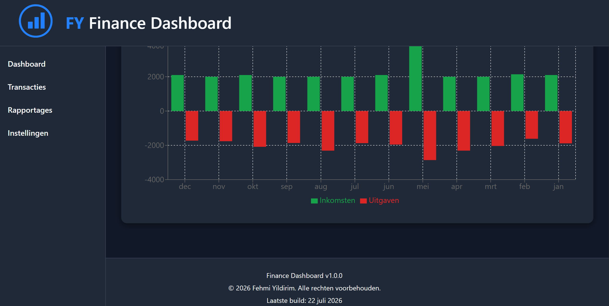
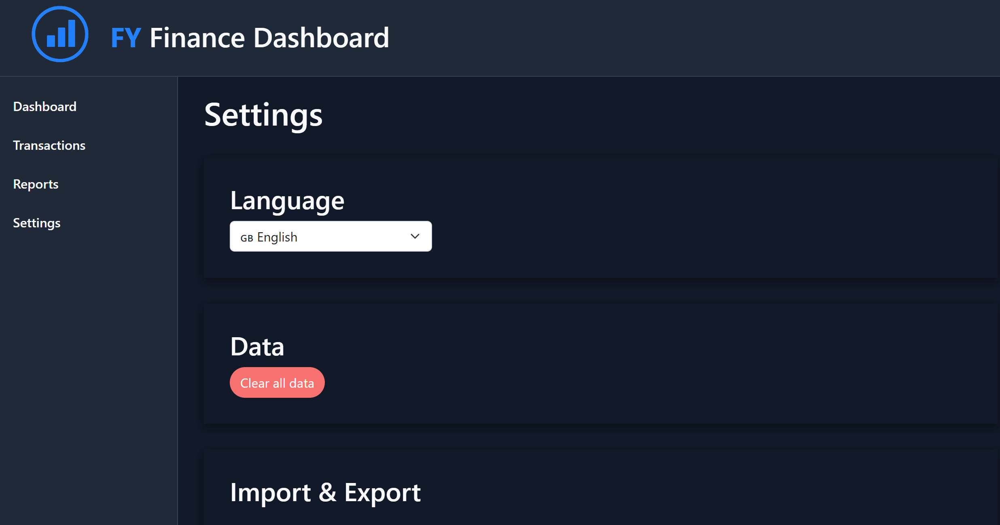

# Finance Dashboard

A modern React application for managing personal finances. Track your income and expenses, visualize your financial data with interactive reports, and import or export your transactions with ease.

---

## Highlights

* Modern React + Vite architecture
* Fully responsive finance dashboard
* Multi-language support (English / Dutch)
* Dark mode support
* Persistent local storage
* Interactive financial charts
* CSV and PDF export

---

## Screenshots






---

# ✨ Features

## Dashboard

* Financial overview
* Income, expenses and balance cards
* Key financial statistics
* Income vs expense chart
* Expense summary by category
* Recent transactions

## Transactions

* Create, edit and delete transactions
* Drawer-based create/edit form
* Search transactions
* Filter by transaction type
* Date range filtering (Today, Month, Year, Custom)
* Sorting
* Pagination

## Reports

* Financial statistics
* Expense distribution by category
* Monthly cashflow chart
* Interactive charts powered by Recharts

## Import & Export

* ING CSV import
* CSV export
* PDF export

## Settings

* Dark / Light mode
* Dutch / English language support
* Clear all application data

## General

* Automatic transaction categorization
* Responsive design
* Local storage persistence

## About App

* Application information page
* Version information
* Developer information
* Technologies overview
* License information

---

# Built With

## Frontend

* React
* Vite
* React Router
* React Bootstrap
* Material UI (Drawer)

## Data & Visualization

* Recharts
* Chart.js
* date-fns

## Utilities

* PapaParse
* jsPDF
* react-datepicker
* react-i18next

---

# Installation

```bash
git clone https://github.com/Fehmi-Yildirim/finance-dashboard.git

cd finance-dashboard

npm install

npm run dev
```

---

# Roadmap

## Finance Features

* Budget management
* Goal tracking
* Multiple accounts
* Recurring transactions
* Currency support

## Analytics

* Advanced reports
* Improved analytics
* Financial trends

## Data Management

* Data backup & restore
* Additional import formats
* Cloud synchronization

## User Experience

* User profiles
* Budget notifications

---

# Project Structure

FINANCE-DASHBOARD
├── public
│
├── screenshots
│
├── src
│
├── assets
│
├── components
│   ├── AddTransaction.jsx
│   ├── BudgetForm.jsx
│   ├── BudgetList.jsx
│   ├── BudgetCard.jsx
│   └── BudgetProgress.jsx
│   ├── Card.jsx
│   ├── Cards.jsx
│   ├── CategorySummary.jsx
│   ├── CSVImport.jsx
│   ├── Footer.jsx
│   ├── Header.jsx
│   ├── Sidebar.jsx
│   ├── TransactionDrawer.jsx
│   ├── TransactionsList.jsx
│   └── TransactionsToolbar.jsx
│
├── config
│   └── appConfig.js
│
├── css
│   ├── components.css
│   ├── darkmode.css
│   ├── layout.css
│   └── variables.css
│
├── data
│   ├── categories.js
│   └── demoTransactions.js
│
├── hooks
│   └── useTransactions.js
│   └── useBudgets.js
│
├── layouts
│   └── MainLayout.jsx
│
├── locales
│   ├── en.json
│   └── nl.json
│
├── pages
│   ├── Dashboard.jsx
│   ├── Transactions.jsx
│   ├── Reports.jsx
│   ├── Settings.jsx
│   ├── Budgets.jsx
│   └── AboutApp.jsx
│
├── services
│   ├── categoryDetector.js
│   ├── csvParser.js
│   └── transactionKey.js
│
├── utils
│   ├── addMissingData.js
│   └── calculateBudgetProgress.js
│   ├── calculateStatistics.js
│   ├── chartUtils.js
│   ├── exportToCSV.js
│   ├── formatCurrency.js
│   ├── formatDate.js
│   ├── formatters.js
│   └── sortTransactions.js
│
├── App.jsx
├── i18n.js
├── index.css
├── main.jsx

├── package.json
├── vite.config.js
├── eslint.config.js
├── .gitignore
└── README.md

---

# Version

Current version: **1.0.0**

Release year: **2026**

---

# License

Copyright © 2026 Fehmi Yildirim

All rights reserved.

This software and source code may not be copied, modified, distributed, or used without explicit permission from the author.